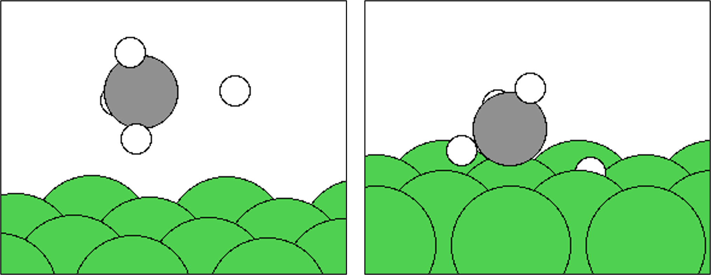
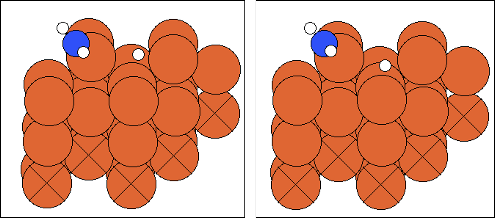

# nebkit
Python toolkit for neb calculation.

## Current Features

This package currently only support surface reactions.

- Given the reactants and products, enumerate the elementary reactions.
- Given a surface, generate different adsorption configurations based on their local environments.
- Match the atomic indices of the reactant and product molecules.
- Perform NEB interpolation for surface reactions, automatically handle physical adsorption states, and address special cases where the initial and final states are too far apart.

## To Do

Support electrochemical case, zeolite catalyst and single atom catalyst.

## Usage

### Binding adsorbate to surface

`nebkit` provide two utility functions to bind an adsorbate or initial and final states to a surface.

```python
# bind a single adsorbate to surface
from nebkit.structure.bind_to_surface import bind_single_ads_to_surface

from ase import Atom
from ase.io import read, write

C_atom = Atom('C')
CH2 = read('CH2.xyz')
surf_Fe = read('POSCAR_Fe_111')

results = bind_single_ads_to_surface(C_atom, surf_Fe)
write("configs_C_Fe.extxyz", results)

results = bind_single_ads_to_surface(CH2, surf_Fe)
write("configs_CH2_Fe.extxyz", results)
```

In `bind_single_ads_to_surface`, we define the local environment of a surface atom by the number of adjacent atoms in the 1st and 2st neighbors, we then classify the surface atoms by local environments and enumerate adsorption configurations. For each type of surface atom, one atom is randomly selected as the binding site and the adsorbate is attached to it, then a small position perturbation in xy direction is applied to the adsorbate. We don't care about the precise position of top, bridge or hollow site here, because these sites are only well defined for very small adsorbate, for example, a single C atom.

For single atom adsorbate, this function generate two configurations for each site type to diversify the adsorption configurations.

```python
# bind initial and final states of NEB path to the surface
from ase.io import read, write
from ase.build import molecule
from ase import Atoms

import numpy as np

from nebkit.structure.bind_to_surface import bind_ini_fin_to_surface

CH4 = molecule('CH4')

numbers = CH4.get_atomic_numbers()
H_index = 0
for i in numbers:
    if i == 1:
        H_index = i
        break
flag = np.arange(len(CH4)) != H_index
CH3 = Atoms(numbers = numbers[flag], 
            positions = CH4.positions[flag])

H = molecule('H')

surf_Fe = read("POSCAR_Fe_111")

ini_configs, fin_configs, _ = bind_ini_fin_to_surface([CH4], [CH3, H], surf_Fe)

write("ini_configs.extxyz", ini_configs)
write("fin_configs.extxyz", fin_configs)
```

In `bind_ini_fin_to_surface`, fragments of initial and final states are firstly combined, the matching of atomic indices and position alignment are then handled automatically. If there are two fragments in initial or final states, two adsorption configurations will be generated for atomic pairs composed of different types of adsorption sites. For example, for the reaction CH4 <-> CH3* + H*, if there two kinds of sites, A and B, then CH3* can bind to A or B, so does H*.

## Enumerate the elementary reactions

Reaction Mechanism Generator (RMG) can generate the reaction mechanisms, but predefined reaction patterns are required and these are not well defined for catalytic reactions. For example, you can not tell which type does the reaction CHCH* + * <-> CH* + CH* belong to. 

In `nebkit`, elementary reactions are generated according to the pure graph-theoretical method. We only change one chemical bond at a time, until we reach the product state and there are no intermediate species left. In this way, reactions such as atomic group transfer and insertion will be split into multiple steps. For example: reactions NH2OH + H <-> NH2 + H2O will be (1) NH2OH <-> NH2 + OH, (2) H + OH <-> H2O, reaction CH3CH3 + CH2: <-> CH3CH2CH3 will be (1) CH3CH3 <-> CH3 + CH3 (2)CH3 + :CH2 <-> CH3CH2 (3)CH3CH2 + CH3 <-> CH3CH2CH3. You need to merge these reactions and delete redundant reactions manually.

```python
# Generate reaction network 
from nebkit.network.system import ReactionSystem
from ase.build import molecule
H2 = molecule('H2')
N2 = molecule('N2')
NH3 = molecule('NH3')
rs = ReactionSystem([H2, N2], [NH3])
rs.generate_elementary_steps(max_natoms_tot=4, max_natoms={'N': 1})
for reac in rs.reactions_list:
    print(reac.reaction_str)
```

To limit the number of reactions in the network, you should set some parameters of `generate_elementary_steps`:

```python
# definition of `generate_elementary_steps`
def generate_elementary_steps(self,
                           ntimes:int = -1,
                           max_natoms_tot:int = -1, 
                           min_natoms_tot:int = 0, 
                           max_natoms:Dict[str, int] = None, 
                           min_natoms:Dict[str, int] = None, 
                           forbidden_pattern: List[Tuple[str, str]] = None):
                           pass
```
- ntimes: Use this argument (>0) to search elementary steps by BFS and DFS method. The first search use BFS to get a shortest path, the following attempts use DFS to randomly search reaction pathes. `ntimes = -1` will return all the possible steps.
- max_natoms_tot: Max totoal number of atoms in a intermediate.
- Min_natoms_tot: Min totoal number of atoms in a intermediate.
- max_natoms: A dict to set max number of atoms for each element.
- min_natoms: A dict to set min number of atoms for each element.
- forbidden_pattern: The forbidden substructure (see below).

```python
# use `forbidden_pattern` to set forbidden substructures.
H2 = molecule('H2')
CO2 = molecule("CO2")
CH4 = molecule("CH4")
CO = molecule("CO")
rs = ReactionSystem([CO2, CH4], [H2, CO])
rs.generate_elementary_steps(max_natoms={'C': 1}, 
    forbidden_pattern=[('O,O', '0-1'), ('H,O,C,O,H','0-1,1-2,2-3,3-4')])
for reac in rs.reactions_list:
     print(reac.reaction_str)

```
In the example, `('O,O', '0-1')` represents a peroxide substructure -O-O-, `('H,O,C,O,H','0-1,1-2,2-3,3-4')` represents a geminal diol substructure H-O-C-O-H. If `forbidden_pattern` is not set, default forbidden patterns are generated, see `nebkit.network.system._get_default_bad_patterns`.

You can merge reactions by using `rs.merge_reactions()`
```python
from ase.build import molecule 
from nebkit.network.system import ReactionSystem

H = molecule('H') # H represent a proton H^{+}
NO = molecule('NO')
H2O = molecule('H2O')
NH3 = molecule('NH3')
H2 = molecule('H2')
rs = ReactionSystem([H, NO], [H2O, NH3, H2])
rs.generate_elementary_steps(max_natoms={'N': 1, 'O':1})
for i, reac in enumerate(rs.reactions_list):
    print(i, reac.unique_reaction_str)
```
The output is 
```
0 [HH] + [HH] <-> [H][H]
1 [HH] + NO <-> [H]NO
2 [HH] + NO <-> [H]ON
3 NO <-> N + O
4 [H]NO + [HH] <-> [H]N([H])O
5 [H]NO + [HH] <-> [H]NO[H]
6 [H]ON + [HH] <-> [H]NO[H]
7 N + [HH] <-> [H]N
8 O + [HH] <-> [H]O
9 [H]NO <-> [H]N + O
10 [H]ON <-> [H]O + N
11 [H]N + [H]O <-> [H]NO[H]
12 [H]NO[H] + [HH] <-> [H]ON([H])[H]
13 [H]N + [HH] <-> [H]N[H]
14 [H]O + [HH] <-> [H]O[H]
15 [H]N([H])O + [HH] <-> [H]ON([H])[H]
16 [H]N([H])O <-> [H]N[H] + O
17 [H]N[H] + [HH] <-> [H]N([H])[H]
18 [H]N[H] + [H]O <-> [H]ON([H])[H]
```

For reactions 
```
10 [H]ON <-> [H]O + N
11 [H]N + [H]O <-> [H]NO[H]
18 [H]N[H] + [H]O <-> [H]ON([H])[H]
```
and reaction
```
14 [H]O + [HH] <-> [H]O[H]
```
There are usually merged, for example, `NOH <-> OH + N` and `OH + H <-> H2O` are merged to get `NOH + H <-> N + H2O`. To do this, use `merge_reactions`.

```python
rs.merge_reactions(10, 14)
rs.merge_reactions(11, 14)
rs.merge_reactions(18, 14)
for i, reac in enumerate(rs.reactions_list):
    print(i, reac.unique_reaction_str) 
# Delete reactions reversely to preserve the index
rs.delete_reaction(18)
rs.delete_reaction(11)
rs.delete_reaction(10)
for i, reac in enumerate(rs.reactions_list):
    print(i, reac.unique_reaction_str) 
```
Because `NOH <-> OH + N` is a slow step, it is redundant with the total reaction `NOH + H <-> N + H2O`, we need to delete it. The deletion can not be done without reaction kinetic data, we left this to the user.


At last, you can build the adsorption structures by using `bind_to_surfaces()`:
```python
H2 = molecule('H2')
N2 = molecule('N2')
NH3 = molecule('NH3')
rs = ReactionSystem([H2, N2], [NH3])
rs.generate_elementary_steps(max_natoms_tot=4, max_natoms={'N': 1})

Fe_111 = read("test/surf/POSCAR_Fe_111")
configs = rs.bind_to_surfaces([Fe_111])
intermediate_index, ini_fin_list = configs[0]

print(intermediate_index)

for i, item in enumerate(ini_fin_list):
    print(item["name"])
    write(f"ini_configs{i}.extxyz", item["ini"])
    write(f"fin_configs{i}.extxyz", item["fin"])
```

The output is
```shell
{'[H][H]': (0, 0, [0, 3, 5]), 'NN': (1, 0, [0, 3, 5]), '[H]N': (2, 1, [0, 5, 8]), '[H]N[H]': (3, 1, [0, 5, 8]), '[H]N([H])[H]': (4, 1, [0, 5, 8])}
[H][H] <-> [HH] + [HH]
NN <-> N + N
[HH] + N <-> [H]N
[H]N + [HH] <-> [H]N[H]
[H]N[H] + [HH] <-> [H]N([H])[H]
```

`intermediate_index` is a `dict`, it contains the index of the adsorbate in the list of initial or final state structures. For example, the index of `'[H]N'` is `(2, 1, [0, 5, 8])`, this means adsorption structures of NH* can be obtained from the final state of reaction `2` with the index of `[0,5,8]`. You can get the adsorption structures of NH* by 

```python
structs = [ini_fin_list[2][1][i] for i in [0,5,8]]
write("NH_ads_configs.extxyz", structs)
```

## Matching the atomic indices of molecules of initial and final states

`nebkit` provides a function `nebkit.tools.matching.match_atom_indices` to match the atomic indices of initial and final state. All the fragments (no more than 2 fragments) of initial state or final state should be combined together to form ONE `ase.Atoms` object. And the initial state or final state should only contains the adsorbate, do not include the surface atoms. Usually you do not need to call this function directly, use `bind_ini_fin_to_surface()` instead.

```python
from nebkit.tools.matching import match_atom_indices
from ase.io import read

# The path to the initial state. 
# Should only contain the adsorbate molecules
ini_path = "" 
atoms_ini = read(ini_path)
atoms_fin = read(fin_path)
new_ini, new_fin = match_atom_indices(atoms_ini, atoms_fin)
```

WARNNING: If there are many atoms, this function will fail for highly symmetric reactions. For example, a methylene carbene inserts into a carbon chain 
$$
\mathrm{CH_2: + CH_2CH_2CH_2CH_2CH_2 \rightarrow  CH_2CH_2CH_2CH_2CH_2CH_2} 
$$
It's impossible to tell where does CH2: go. Another case is 
$$
\mathrm{OH\text{-}CHCHCH_2CH_2CH_2CH_2CH_2 \rightarrow  CHCHCH_2CH_2CH_2CH_2CH_2\text{-}OH} 
$$

For large molecules, we delete all the H atoms firstly can then match the molecular skeleton, so we can not distinguish O-C-C and C-C-O. To handle these situations, the only way is brute force enumeration.

```python
def match_atom_indices(atoms1:Atoms, 
                       atoms2:Atoms, 
                       n_permutation_all:int = 200,
                       n_permutation_heavy:int = 100,
                       skin:float = 0.1) -> Tuple[list, Atoms, Atoms]:
```

If the number of permutation of all atoms (including H) is less than `n_permutation_all`, `match_atom_indices` will match the indices by considering the full permutation among the same type of atoms (including H). If the number of permutation of heavy atoms is less than `n_permutation_heavy`, `match_atom_indices` will consider the permutations of heavy atoms first and the macth H atoms.

## Build initial NEB path

idpp method implemented in `ase` can handle most cases, but it can also generate unreasonable images, for example

For reaction CH4 <-> CH3 + H, CH4 is in the vacuum region. If you use idpp method directly (left figure), CH4 will split in the vacuum. Another case is 

H atoms also floats in vacuum if you use `idpp`. The function `nebkit.nebpath.surface_reactions.build_surface_neb_path` will process these two special case (right figures).